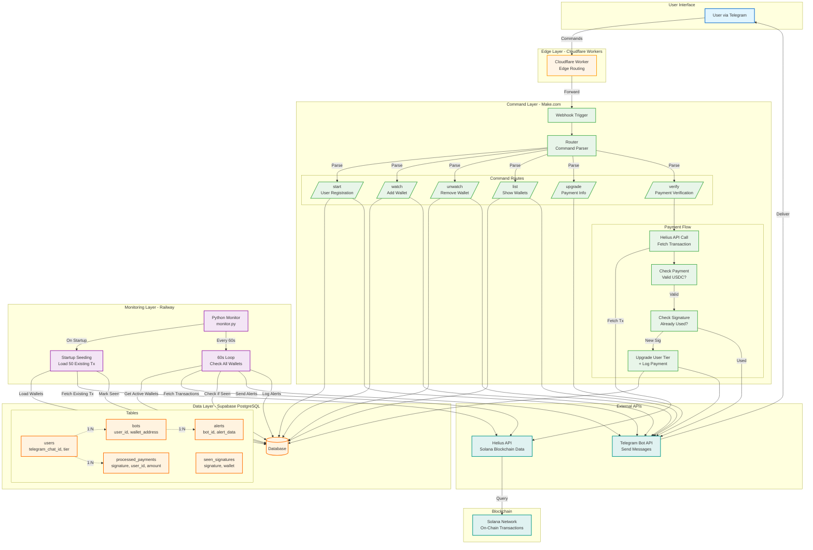

# ⚡ Alert Forge

Real-time Solana wallet monitoring via Telegram. Get instant alerts for every transaction. Built for traders, researchers, and operators.

**[Try it now →](https://t.me/alertforge_intenxe_bot)**

---

## 🎯 What It Does

Monitor any Solana wallet and get instant Telegram alerts for:
- 💸 SOL transfers (sent/received)
- 🪙 Token transfers
- 📊 Transaction details (amount, fee, signature)
- 🔗 Direct Solscan links

No dashboards. No polling. Just alerts when it matters.

---

## 🚀 Quick Start

1. **Start the bot:** `/start`
2. **Add a wallet:** `/watch <wallet_address>`
3. **Get alerts:** Instant notifications for new transactions

**Free tier:** Monitor 1 wallet  
**Pro tier:** Monitor 3 wallets ($10 USDC/month)  
**Premium tier:** Unlimited wallets ($30 USDC/month)

---

## 📱 Commands

| Command | Description |
|---------|-------------|
| `/start` | Register and get started |
| `/watch <address>` | Start monitoring a wallet |
| `/unwatch <address>` | Stop monitoring a wallet |
| `/list` | Show all monitored wallets |
| `/upgrade` | View upgrade options |
| `/verify <signature>` | Verify USDC payment and upgrade |

---

## 💳 How Payment Works

1. Send `/upgrade` to see payment instructions
2. Send 10 USDC (Pro) or 30 USDC (Premium) to the payment address
3. Copy your transaction signature
4. Send `/verify <signature>`
5. Instant upgrade - no manual approval needed

**Why USDC?**
- ✅ Instant verification (on-chain proof)
- ✅ No KYC/cards required
- ✅ Global - works anywhere
- ✅ Trustless - blockchain doesn't lie

---

## 🏗️ Tech Stack

**Hybrid Architecture:**
- **Commands:** Make.com (visual workflow automation)
- **Monitoring:** Python on Railway (24/7 background worker)
- **Edge Routing:** Cloudflare Workers
- **Database:** Supabase (PostgreSQL)
- **Blockchain Data:** Helius API
- **Alerts:** Telegram Bot API

**Why hybrid?**
- Make.com = fast iteration on commands
- Python = unlimited monitoring operations
- No operation limits, infinite scale

---

## 🏗️ System Architecture


## 🔧 Self-Hosting

### Prerequisites
- Telegram Bot Token
- Supabase Project
- Helius API Key
- Railway Account (or any hosting)

### Setup

1. **Clone the repo:**
```bash
git clone https://github.com/intenxe-ops/alert-forge.git
cd alert-forge
```

2. **Environment variables:**
```bash
cd bot
cp .env.example .env
# Add your keys to .env
```

3. **Install dependencies:**
```bash
pip install -r requirements.txt
```

4. **Database setup:**
Create tables in Supabase SQL Editor:
```sql
-- Users
CREATE TABLE users (
  id UUID PRIMARY KEY DEFAULT gen_random_uuid(),
  telegram_chat_id TEXT UNIQUE NOT NULL,
  subscription_tier TEXT DEFAULT 'free',
  created_at TIMESTAMPTZ DEFAULT NOW()
);

-- Monitored wallets
CREATE TABLE bots (
  id UUID PRIMARY KEY DEFAULT gen_random_uuid(),
  user_id UUID REFERENCES users(id) ON DELETE CASCADE,
  wallet_address TEXT NOT NULL,
  is_active BOOLEAN DEFAULT true,
  created_at TIMESTAMPTZ DEFAULT NOW()
);

-- Alert history
CREATE TABLE alerts (
  id UUID PRIMARY KEY DEFAULT gen_random_uuid(),
  bot_id UUID REFERENCES bots(id) ON DELETE CASCADE,
  alert_type TEXT NOT NULL,
  alert_data JSONB,
  sent_at TIMESTAMPTZ DEFAULT NOW()
);

-- Deduplication
CREATE TABLE seen_signatures (
  id BIGSERIAL PRIMARY KEY,
  signature TEXT UNIQUE NOT NULL,
  wallet_address TEXT NOT NULL,
  created_at TIMESTAMPTZ DEFAULT NOW()
);

-- Payment tracking (prevents signature reuse)
CREATE TABLE processed_payments (
  id UUID PRIMARY KEY DEFAULT gen_random_uuid(),
  signature TEXT UNIQUE NOT NULL,
  user_id UUID REFERENCES users(id),
  amount NUMERIC NOT NULL,
  tier_granted TEXT NOT NULL,
  processed_at TIMESTAMPTZ DEFAULT NOW()
);

-- Indexes
CREATE INDEX idx_user_chat_id ON users(telegram_chat_id);
CREATE INDEX idx_bot_wallet ON bots(wallet_address);
CREATE INDEX idx_bot_user ON bots(user_id);
CREATE INDEX idx_sig ON seen_signatures(signature);
CREATE INDEX idx_payment_sig ON processed_payments(signature);
```

5. **Deploy monitoring:**
```bash
# Local testing
python monitor.py

# Production: Deploy to Railway
# Connect GitHub repo, set env vars, deploy
```

6. **Make.com setup:**

Visual workflow handles commands. Architecture:
- Webhook → Router → Command handlers → Supabase + Telegram
- 6 routes: /start, /watch, /unwatch, /list, /upgrade, /verify

7. **Cloudflare Worker:**
```bash
cd cloudflare
# Deploy worker.js to Cloudflare
# Set MAKE_WEBHOOK_URL environment variable
```

8. **Set Telegram webhook:**
```bash
curl -X POST "https://api.telegram.org/bot<YOUR_BOT_TOKEN>/setWebhook" \
  -H "Content-Type: application/json" \
  -d '{"url": "https://your-worker.workers.dev/"}'
```

---

## 📊 Database Schema
```sql
users
├─ id (UUID)
├─ telegram_chat_id (TEXT, unique)
├─ subscription_tier (TEXT: 'free', 'pro', 'premium')
└─ created_at (TIMESTAMPTZ)

bots
├─ id (UUID)
├─ user_id (UUID → users.id)
├─ wallet_address (TEXT)
├─ is_active (BOOLEAN)
└─ created_at (TIMESTAMPTZ)

alerts
├─ id (UUID)
├─ bot_id (UUID → bots.id)
├─ alert_type (TEXT)
├─ alert_data (JSONB)
└─ sent_at (TIMESTAMPTZ)

seen_signatures
├─ id (BIGSERIAL)
├─ signature (TEXT, unique)
├─ wallet_address (TEXT)
└─ created_at (TIMESTAMPTZ)

processed_payments
├─ id (UUID)
├─ signature (TEXT, unique)
├─ user_id (UUID → users.id)
├─ amount (NUMERIC)
├─ tier_granted (TEXT)
└─ processed_at (TIMESTAMPTZ)
```

---

## 🛣️ Roadmap

- [x] Wallet monitoring
- [x] USDC payment verification
- [x] Tier system
- [ ] Token price alerts
- [ ] NFT floor tracking
- [ ] Web dashboard
- [ ] Multi-chain support (ETH, Base, Arbitrum)

---

## 📝 License

MIT

---

## 📞 Contact

Questions? Telegram: @intenxe22

---

**Built with the Operator Doctrine.**  
*Ship systems, not dashboards.*